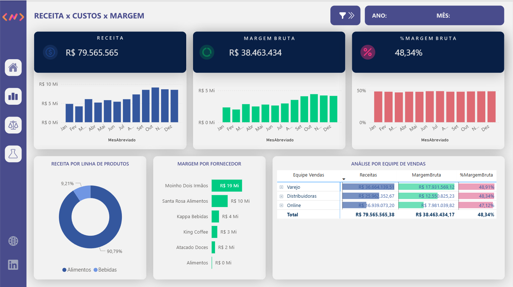
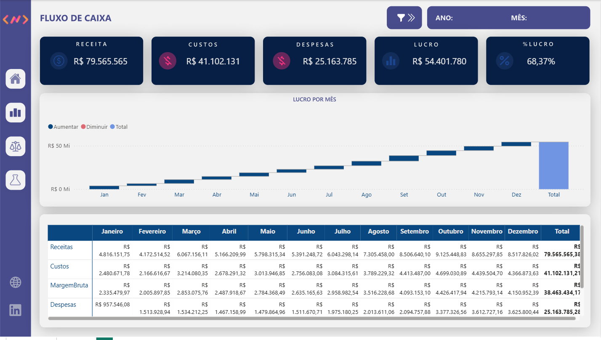
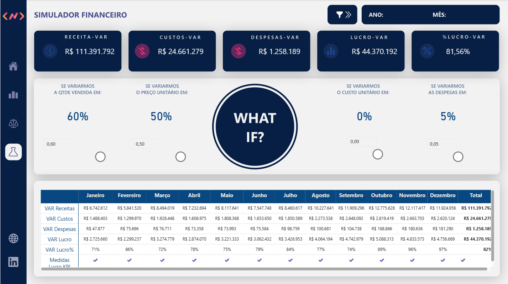

# Dashboard Financeiro – Análise de Margens

## 📌 Contexto
Este projeto foi desenvolvido para analisar a rentabilidade financeira por meio do acompanhamento de receitas, custos e margens, permitindo avaliar o desempenho por fornecedor e apoiar decisões estratégicas. O dashboard também conta com um simulador de cenários para análise de variações na receita.

## 🗃️ Dados
- Dados financeiros simulados
- Principais campos: data, fornecedor, receita, custo, margem, categoria e tipo de conta

## 🔧 Tratamento e Modelagem dos Dados
- Padronização e limpeza dos dados
- Criação de medidas financeiras
- Cálculo das métricas de margem:
  
  Margem Bruta = Receita - Custos  
  % Margem Bruta = Margem Bruta / Receita

## 📊 Dashboard
O dashboard contempla:
- KPIs financeiros (Receita, Custos, Margem Bruta e % Margem)
- Receita por período
- Margem bruta por fornecedor
- Comparativo de receita x margem
- Análise de rentabilidade por fornecedor
- Simulador de cenários para avaliar aumento ou diminuição da receita e seu impacto nos resultados futuros

### Visão Geral

### Vendas

### Fluxo de Caixa

### Simulador de Cenários
Esta seção permite simular variações positivas ou negativas na receita, possibilitando estimar o impacto dessas mudanças no resultado financeiro futuro.

## 🎯 Insights
- Identificação dos fornecedores mais rentáveis
- Análise do impacto dos custos na margem
- Avaliação de cenários futuros a partir da simulação de variações na receita
- Apoio à tomada de decisão sobre negociação, priorização de fornecedores e planejamento financeiro

## 🛠️ Ferramentas
- Power BI
